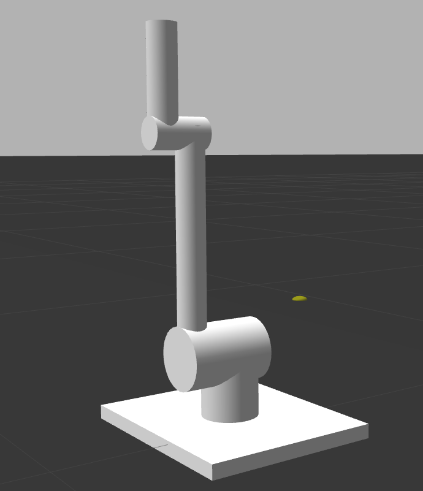
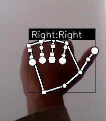
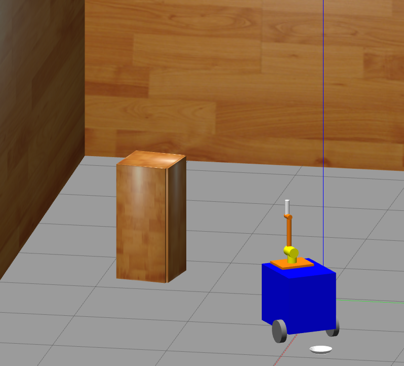
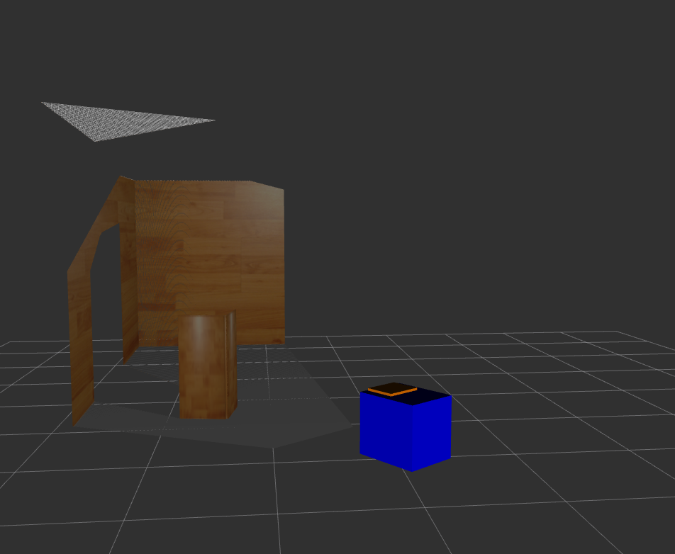
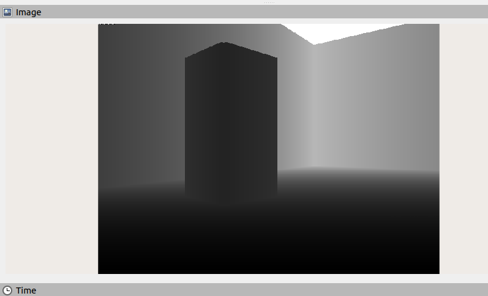
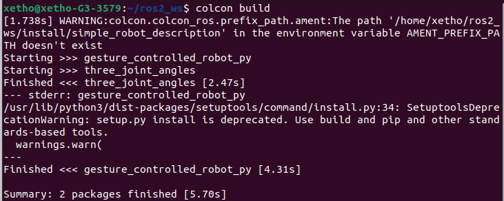

// Currently planning to add path finding to the robot using simple AI algorithms such as A* Search

**[Group Members]**

1.  Dawit Getahun UGR/9220/13

2.  Metsakal Zeleke UGR/1027/13

3.  Tewodros Berhanu UGR/9715/13

4.  Tinsae Shemalise UGR/6075/13

5.  Yohannes Dessie UGR/7612/13

# Gesture Controlled Wheeled Robot with 3 DOF Arm, and Collision Avoidance

# Introduction

This report provides an overview of the design and implementation of a
ROS2 based robot we designed for our course project. The robot is
designed to be operated via teleop using a keyboard as well as palm
gestures from a laptop camera feed within the gazebo environment. The
primary functionalities of the robot include controlling the wheeled
base motion, simple obstacle avoidance to prevent collisions using a
depth camera, and manipulation of the robotic arm using joint angles for
the arm joints.

# Robot Design

The robot is built upon a wheeled base platform, which serves as its
primary mode of locomotion. The base is equipped with motors and wheels
for omnidirectional movement, allowing the robot to navigate through
various environments efficiently. Mounted at the front of the wheeled
base is a depth camera, which provides real-time depth perception to the
robot.

When designing the robot, we identified the different components
required and designed them in separate .xacro files, which are then
compiled into one .urdf file during the execution of the code. Below, we
will be going over some of the main components of our design.

## Components

### Robot Arm

The robot arm has 4 main links connected by 3 joints.

-   *link_0* serves as the base link of the arm, and connects to the
    main robot body(the wheeled base).

-   *link_1* is connected to *link_0* via *joint_1* and represents the
    first segment of the arm. *Joint_1* is a revolute joint and it
    allows *link_1* to rotate about the z-axis.

-   *link_2* is connected to *link_1* via *joint_2* and represents the
    second segment of the arm. *Joint_2* is also a revolute joint and
    allows *link_2* to rotate about the x-axis.

-   *link_3* is connected to *link_2* via *joint_3* and represents the
    end effector or tool mounted on the arm. There is no gripper
    attached to the link however.

Beside these links and joints, the robot also consists of end_links and
joints for these links, that are located at the end of links 1 and 2.
Their joints are fixed. The robot arm on it's own is displayed below.

{width="5.432292213473316in"
height="6.302851049868766in"}

### Mobile Base

The mobile base is the main base for the entire robot. It consists of
the base link and 3 wheels for motion, and it is where the depth-camera
and robot arms are attached as well.

-   **base_footprint**: This link represents the base of the robot. It
    is used here as the reference frame for the robot\'s movement and
    positioning.

```{=html}
<!-- -->
```
-   **base_link**: This link represents the main body of the robot. It
    is visualized as a box with dimensions 0.55m x 0.45m x 0.5m. It has
    inertial definition and a collision geometry matching the visual
    geometry.

-   **right_wheel_link** and **left_wheel_link**: These links represent
    the right and left wheels of the robot, respectively. They are
    visualized as cylinders with a length of 0.05m and a radius of 0.1m.
    Both wheel links have collision geometries matching the visual
    geometries and inertial definitions specifying a mass of 1.0 unit
    and inertia values.

```{=html}
<!-- -->
```
-   **caster_wheel_link**: This link represents a caster wheel, used for
    stability and support. It also allows the robot to turn in both left
    and right directions. It is visualized as a sphere with a radius of
    0.05m.

These links are connected by 4 joints specified below.

-   **base_joint**: A fixed joint connecting the base_footprint to the
    base_link.

-   **base_right_wheel_joint** and **base_left_wheel_joint**: Continuous
    joints connecting the base_link to the right_wheel_link and
    left_wheel_link, respectively. These joints allow rotation about the
    y-axis to allow the entire link to turn left/right and have origins
    and axes defining the positions and orientations of the wheels
    relative to the base_link.

```{=html}
<!-- -->
```
-   **base_caster_wheel_joint**: Another fixed joint connecting the
    base_link to the caster_wheel_link, with an origin offset along the
    x-axis and z-axis.

{width="4.589885170603675in"
height="5.336298118985127in"}

### Full Robot Design

Overall, combining the arm, the wheeled base and the depth camera, we
have the final design displayed below.

{width="6.5in"
height="7.541666666666667in"}

The red rectangle in the front of the wheeled base is the depth-camera.

# Functionalities and Features

## **Control** **Mechanisms**

The robot\'s control mechanisms are implemented using ROS2 nodes, which
facilitate communication between different components of the system. The
following nodes are utilized:

### Teleoperation 

The teleoperation functionality is facilitated by the
teleop_twist_keyboard package, a widely-used ROS2 package specifically
designed for teleoperating mobile robots using keyboard inputs. This
node translates keyboard commands into Twist messages, containing linear
and angular velocities, enabling intuitive control of the wheeled
base\'s motion.

The wheeled base of the robot can also respond to this form of control
and subscribes to the *cmd_vel* topic as well.Users can easily maneuver
the robot in various directions by pressing designated keys, allowing
for efficient navigation in diverse environments.

### Gesture Detection 

To provide an alternative control interface, a custom node is
implemented for gesture detection using the laptop camera feed. Using a
hand recognition library obtained
[[online]{.underline}](https://github.com/kinivi/hand-gesture-recognition-mediapipe),
this node analyzes the camera feed to detect predefined palm gestures.
The online library we used has functionality to detect palm gestures and
has a setting that allows training of custom commands, so we used that
and trained the model with a few gestures we found to be somewhat
comfortable to perform. We then updated the model and integrated it with
our custom node to translate the gestures into movement commands for our
robot.

{width="1.3242825896762904in"
height="1.529453193350831in"}{width="1.328125546806649in"
height="1.5245374015748032in"}{width="1.3266655730533683in"
height="1.5122134733158354in"}{width="1.3177088801399826in"
height="1.5074584426946631in"}{width="1.3385422134733158in"
height="1.51125656167979in"}

Upon detection, the gestures are interpreted as commands for controlling
the robot\'s movement or manipulation.

To use this form of control, just **point your thumb** in the direction
you want the robot to move with your thumb, while the rest of the hand
is closed. The detection is also better when used with your **right
hand.**

### Wheeled Base Movement 

This node receives motion commands from either the teleoperation node or
the gesture detection node and translates them into motor control
signals for the wheeled base, enabling smooth and precise movement.

### Robot Arm Control Nodes

Two nodes are dedicated to controlling the robotic arm, the
trajectory_publisher and trajectory_subscriber nodes. The subscriber
node receives a message on a custom topic */movement/cmd_joint_angles*
of a custom type that we defined, building on one of the assignments
given to us in class. The message is a set of 3 joint angles that allow
us to configure the robot arm through its 3 joints in different ways.
The *trajectory_subscriber* node then converts these into a
*JointTrajectory* message that moves the robot arm.

The *trajectory_publisher* node lets the user input the three angles
from the terminal, and publish it to the */movement/cmd_joint_angles*
topic for the subscriber node.

### Obstacle Avoidance

In this node, the robot uses the sensor(depth camera) to prevent
collisions of the robot. The depth camera data is processed by this node
to detect obstacles in front of the robot. If an obstacle is detected
within a predefined range, the node sends signals to halt the forward
movement of the wheeled base, preventing collisions or damage to the
robot base, camera or arm.

Let's visualize the depth-camera using rviz2.

{width="3.182292213473316in"
height="2.8792158792650917in"}{width="3.4027777777777777in"
height="2.807292213473316in"}

In the pictures above, first we have the robot's position and
environment in Gazebo. On the right we have its visualization in Rviz2,
using PointCloud2 to show the camera feed from the depth camera. What it
exactly sees is also shown below.

{width="6.067708880139983in"
height="3.6853554243219597in"}

We use this to calculate the distance of the robot from the object in
front of it, and stop it if it gets too close. The robot will also not
be able to make any forward movements once it's within this range.

# Running the program

## Prerequisites 

The program has quite a few dependencies, so they first need to be
installed.

-   Install Tensorflow

  -----------------------------------------------------------------------
  ros2_ws\$ pip install tensorflow
  -----------------------------------------------------------------------

  -----------------------------------------------------------------------

-   Cv2

  -----------------------------------------------------------------------
  ros2_ws\$ pip install opencv-contrib-python
  -----------------------------------------------------------------------

  -----------------------------------------------------------------------

-   Joint state publisher

  -----------------------------------------------------------------------
  ros2_ws\$ sudo apt install ros-humble-joint-state-publisher
  -----------------------------------------------------------------------

  -----------------------------------------------------------------------

-   Controller Manager

+-----------------------------------------------------------------------+
| ros2_ws\$ sudo apt install ros-humble-ros2-control                    |
|                                                                       |
| ros2_ws\$ sudo apt install ros-humble-ros2-controllers                |
|                                                                       |
| ros2_ws\$ sudo apt install ros-humble-gazebo-ros-pkgs                 |
+=======================================================================+
+-----------------------------------------------------------------------+

After the python dependencies have been installed, navigate to the
directory containing the packages and ensure all required packages are
present and the directory structure looks like this.

{width="5.572916666666667in"
height="2.9583333333333335in"}

The last package, *three_joint_angles,* is our custom message type and
is also **required** as it is needed for the robot arm movement
functionality (it's also provided with the source code).

Next, we need to build the package.

Again, **BOTH packages are required** for the project, and both need to
be built together.

## {width="6.5in" height="2.5972222222222223in"}

## Starting the program

To start the program, run the launch file with the command:

  -----------------------------------------------------------------------
  ros2_ws\$ ros2 launch gesture_controlled_robot_py gazebo.launch.py
  -----------------------------------------------------------------------

  -----------------------------------------------------------------------

This will launch the gazebo simulator, and the various different nodes.
Since we are also using tensorflow during this, this process might take
some time, especially launching the laptop camera.

## Running the Teleop for the robot base(wheeled base)

The following will run the Teleop and allow the wheeled base to be
controlled by keyboard inputs

  -----------------------------------------------------------------------
  ros2_ws\$ ros2 run teleop_twist_keyboard teleop_twist_keyboard
  -----------------------------------------------------------------------

  -----------------------------------------------------------------------

## Moving the Robot Arm

To move the robot arm, we need to run the publisher node in a separate
terminal and input the three desired angles for the three joints. Run
the node with the command:

  -----------------------------------------------------------------------
  ros2_ws\$ ros2 run gesture_controlled_robot_py trajectory_publisher
  -----------------------------------------------------------------------

  -----------------------------------------------------------------------

Then, input the three desired angles for the robot arm

{width="5.390625546806649in"
height="0.5157097550306212in"}

{width="2.6174857830271216in"
height="3.6093755468066493in"}{width="2.569675196850394in"
height="3.5468755468066493in"}

# Summary

In this document, we have outlined the design of our robot and its
functionalities implemented with ros2 and gazebo. The robot design is
made of several components, and we saw the designs of the **robot arm**,
**the wheeled base**, and **the depth-camera** and its image-feed. The
functionality of the robot includes **Palm** **Gesture and Teleop
controls for movement**, **movement of the robot arm** with joint angles
and **collision avoidance** using the depth camera.
